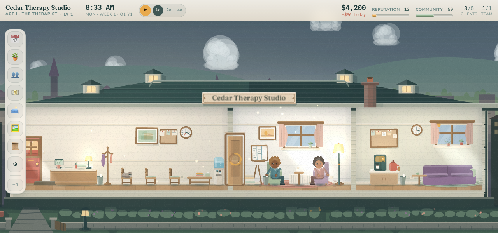
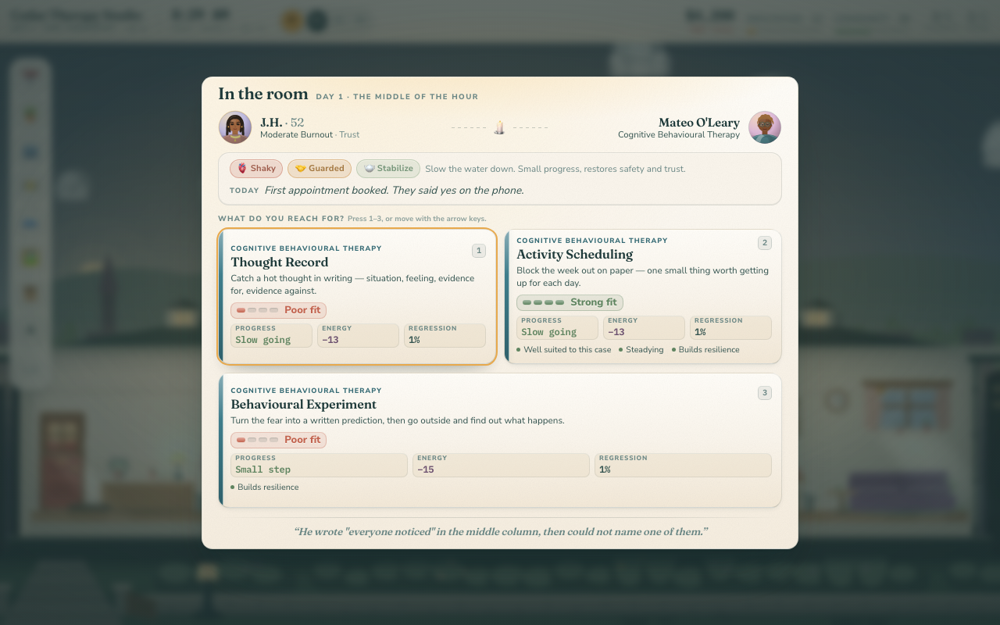
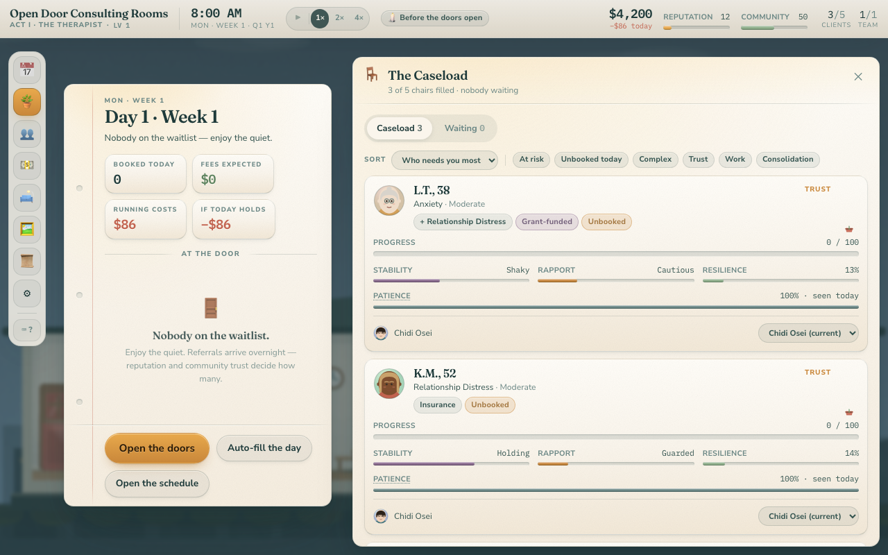

<div align="center">

# Therapy Tycoon II

### The Lamplit Clinic

**A cozy practice-management sim where the product is care.**

[**▶ Play it in your browser**](https://jptech.github.io/therapytycoon2/)

[](https://github.com/jptech/therapytycoon2/actions/workflows/ci.yml)
[](https://github.com/jptech/therapytycoon2/actions/workflows/deploy.yml)




</div>

You start as a solo therapist with three people on your waitlist and grow into a beloved community
institution — and the central promise is that **your job changes as you grow**. Nobody is a stat
block, no outcome is hidden from you, and on the gentlest difficulty you cannot go bankrupt:
running out of money starts a story, not a game over.

Everything you see is drawn in code. There are no image files, no audio files and no network
requests — the office is procedural PixiJS, the portraits are seeded from each client's id, and
every sound is synthesised in an F-major pentatonic so a long session never grates.

```bash
bun install && bun run dev
```

---

## The shape of a run

The game is built as **three acts**, each with a different player role. Each act's systems are the
automation of the previous act's chores — which is how a twenty-hour playthrough avoids going
stale, and how the early game stays small and intimate rather than being a crippled version of the
full one.

| Act | Days | You are | The verb |
| --- | --- | --- | --- |
| **I — The Therapist** | 1–14 | Your own therapist, 3–5 clients | Running sessions |
| **II — The Practice Owner** | ~15–55 | An employer | Hiring, scheduling, cash flow |
| **III — The Director** | ~55+ | An institution-builder | Writing policies, launching programs |

The acts are not hard-gated modes — they are an experience curve created by unlock pacing. A player
who enjoys hand-booking every hour can keep doing it forever.

## The session loop



Every session has three beats:

1. **Plan** — pick a focus. *Stabilize* (safe, restores the client's footing), *Process* (big
   progress, costly, genuinely risky if they are not ready), or *Build Skills* (steady progress,
   raises the resilience that protects against future regression). A destabilised client punished
   for Processing too early is the game teaching real therapeutic pacing.
2. **Play** — mid-session, pick a **technique card** drawn from that therapist's learned
   repertoire. A CBT therapist offers *Thought Record*; an EMDR therapist offers *Bilateral
   Processing*. Training changes what your choices look like in play, not a hidden multiplier.
3. **Reflect** — a card showing the client's arc advancing, the progress delta, and any
   breakthrough, plateau or regression **with its cause stated plainly**.

Sessions come in four shapes. An hour can hold one person, a couple, a family, or a circle of up to
six — and a group hour is a single slot at a lower fee per head, moving everyone a little more
slowly, paced by whoever in the room is least steady.

## Design commitments



- **No hidden punishments.** Every negative outcome states its cause, and regression odds are shown
  *before* you commit to a risky choice. This one is structural rather than a convention — the sim
  hands the UI the complete explanation of a session, so the card cannot drift from what the game
  actually did.
- **Success creates new decisions, not friction.** Reputation doesn't make clients less patient; it
  changes *who is referred to you*. Higher standing brings complex, comorbid, higher-severity cases
  that pay more and demand more.
- **Approachable, never brutal.** On *Cozy*, bankruptcy is impossible — running out of money
  triggers a hardship arc.
- **Anonymised dignity.** Clients appear as "A.M., 34" with a face, a two-line backstory and a
  visible arc. They are people, not diagnoses.

## How it is kept honest

Four instruments, and each sees a class of problem the others structurally cannot:

| | Catches | Cannot see |
| --- | --- | --- |
| `bun run test` | Formulas, liveness, saves, content integrity | A 60-year-old referred for "Child Behavioral" |
| `bun run balance` | Late-game rot, difficulty curves, the economy | The same dilemma firing three mornings running |
| `bun run playtest` | Pacing, story beats, what one run feels like | A tooltip running off the right-hand edge |
| `bun run test:e2e` | What a person actually sees in a browser | A curve going soft over two hundred days |

The balance harness is the discipline that keeps this from re-inheriting the invisible late-game rot
that killed the first version. It runs thousands of headless 200-day playthroughs and reports the
curves — including a check that says so, loudly, if the game has been *solved*:

```bash
bun run balance -- --runs 60 --days 200 --difficulty cozy,standard,challenge --csv balance-out
bun run balance -- --policy adversarial    # measure the floor, not the curve
```

Its companion answers the question statistics cannot. Where the harness asks *are the curves right
across a thousand runs*, the playtest asks *what does one run actually feel like* — printing the
story beats, the dilemmas chosen and the goodbyes in order:

```bash
bun run playtest -- --seed 7 --days 90 --difficulty challenge
```

And because the simulation is a pure function of `(state, action, rng)`, any run can be recorded and
replayed exactly, which makes a bug report reproducible rather than anecdotal:

```bash
bun run replay my-run.json --verify
```

## Commands

```bash
bun run dev          # dev server
bun run build        # production build
bun run test         # vitest — formulas, day-loop liveness, saves, content integrity
bun run test:e2e     # Playwright — one full day in a real browser (see docs/TESTING.md)
bun run typecheck    # tsc --noEmit
bun run balance      # headless balance harness (see docs/BALANCE.md)
bun run playtest     # narrate a single run: the beats, events and goodbyes in order
bun run replay       # replay a recorded action log; --verify proves it reproduces
```

The browser suite starts its own dev server, but it needs its browser downloaded once per machine:

```bash
bun run e2e:install   # once, then bun run test:e2e (~50s)
```

## Architecture, in one paragraph

`src/sim/` is the entire game as a headless, deterministic simulation — **no React, no Pixi, no
DOM, no `Date.now()`, no `Math.random()`.** That one constraint is what makes the balance harness,
the tests and deterministic replay possible, and it is the most load-bearing decision in the
codebase. The UI reads through selectors and never mutates state; everything goes through
`dispatch`. Every tuning number lives in a single file. The PixiJS office is lazy-loaded behind a
boundary that degrades to nothing, so the game stays fully playable on a machine without WebGL.

## Documentation

| Document | What's in it |
| --- | --- |
| [CLAUDE.md](CLAUDE.md) | Start here if you're working on the code |
| [docs/DESIGN.md](docs/DESIGN.md) | Every system, and which v1 failure it answers |
| [docs/ARCHITECTURE.md](docs/ARCHITECTURE.md) | Code layout, the sim/UI contract, how to extend |
| [docs/BALANCE.md](docs/BALANCE.md) | The harness, the current curves, how to retune |
| [docs/CONTENT.md](docs/CONTENT.md) | Adding techniques, events, arcs and programs |
| [docs/TESTING.md](docs/TESTING.md) | What each test layer is for, and what it cannot see |
| [docs/PROGRESS.md](docs/PROGRESS.md) | What was built, in what order, and what broke |
| [FUTURE_WORK.md](FUTURE_WORK.md) | Known gaps and the next things worth doing, ranked |

## Stack

TypeScript · Vite · React 19 · PixiJS v8 · Zustand · Tailwind v4 · Web Audio. Package manager and
runtime is [Bun](https://bun.sh).

## A note on the subject matter

This is a game about running a therapy practice, written with care but no clinical authority. It
makes no outcome guarantees, uses no real brands or people, and is not a model of treatment. If you
are looking for help rather than a game, please talk to someone qualified.

## License

[MIT](LICENSE).
